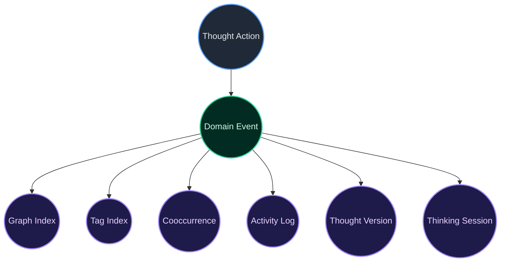

# Thought Domain Event Flow

## Explanation

- Thought write actions dispatch domain events from the Thought services after persistence and link synchronization complete.
- Listener classes react to those events to keep the graph index, tag index, cooccurrence signals, activity log, versions, and thinking-session counters synchronized.
- The event-driven design keeps derived data updates out of the core write services, which reduces coupling and keeps the lifecycle pipeline easier to extend.
